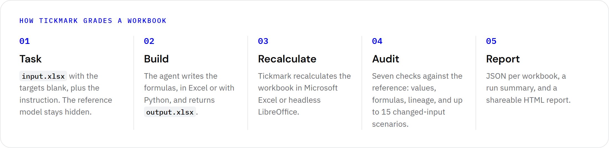

<p align="center">
  
</p>

<h1 align="center">Tickmark</h1>

<p align="center">
  <b>Right numbers aren't a model.</b><br>
  An open benchmark by AAI Labs for AI agents that build financial models in Excel.
</p>

<p align="center">
  <a href="https://github.com/kostas-antiup/Tickmark/actions/workflows/ci.yml"></a>
  
  
  
  
  
  <a href="LICENSE"></a>
</p>

A spreadsheet can show the right answer and still be useless as a financial model. If an
agent types 9,080,487 into the total cell instead of building it from the inputs, the total
is right today and wrong as soon as someone changes an assumption. Benchmarks that only
compare cell values cannot tell the two workbooks apart.

Tickmark grades a completed workbook against a hidden reference workbook. It asks four
questions:

1. Do the target cells hold the same values as the reference?
2. Are they formulas rather than typed numbers?
3. Do the formulas trace back to the declared input cells?
4. When Tickmark changes the inputs, do the targets still match the reference?

The last question catches what the first three miss. A formula such as
`=C20+D20+E20+1161600` is live, traces to the inputs and gives the right total, but
`1161600` is a pasted subtotal. Once the inputs change, the total stops matching. Grading
is deterministic: the same workbook always gets the same verdict.

<p align="center">
  
</p>

## Headline result

We broke each of the 35 reference models in seven ways, from a pasted final answer to a
formula that is 1% off. Then we graded all 245 broken workbooks with each benchmark's rule:

| Grader | Broken workbooks caught | Correct models accepted |
|---|---:|---:|
| SpreadsheetBench rule | 70 / 245 (29%) | 35 / 35 |
| SheetCopilot rule | 70 / 245 (29%) | 35 / 35 |
| **Tickmark** | **245 / 245 (100%)** | **35 / 35** |

The value-only rules catch the 70 workbooks whose numbers are wrong. They miss all 175 whose
numbers are still right: pasted answers (the final output, half or all of the targets, or
one intermediate cell) and formulas that hold only a constant, such as `=9080487`. Both
rules are reproduced from their upstream code in [`baselines.py`](src/tickmark/baselines.py).
All workbooks were recalculated in Microsoft Excel; [reproduce it](docs/results.md#reproduce).

### One formula, three verdicts

Case `14_07` is a rent roll. This submission gets all 20 target values right, every target
is a formula, and every formula traces back to the inputs:

```text
RentRoll!G20  =C20+D20+E20+1161600        9,080,487   matches the reference
```

`1161600` is the 3-Bed total, typed in where `F20` belongs. Both value-only graders pass
the workbook. Tickmark fails it and names the five 3-Bed inputs that `G20` ignores:

```bash
uv run python scripts/run_benchmark.py --case data/cases/14_07 --workbook examples/14_07-hidden-constant.xlsx --sensitivity
```

```text
14_07   FAIL  value=1.00 formulas=1.00 trace=1.00 input_change=True perturbation=False
          = existing benchmarks: SpreadsheetBench-style PASS · SheetCopilot-style PASS
          - Correct only for the given inputs: RentRoll!G20 stops matching the reference model when inputs change (hidden hardcoded or input-independent logic).
          - RentRoll!G20 diverges from the reference when RentRoll!F7, RentRoll!F10, RentRoll!F12, RentRoll!F14 or RentRoll!F16 changes alone.
```

The single input-change test passes here: it changes a Studio input, and `G20` still moves
correctly. The perturbation scenarios change every input at once, and that exposes the
pasted number.

## Leaderboard

AI agents on the three pilot cases. **Real models** counts the cases where every value was
right and every check passed. **Right numbers** counts the cases where every value was
right, which is all a value-only benchmark checks. To add an agent, see
[docs/leaderboard.md](docs/leaderboard.md).

<!-- leaderboard:start -->
<p align="center"></p>

<details>
<summary>Table view</summary>

| # | Agent | Interface | Real models | Right numbers | Checks passed | Values right | Formulas | Traceable | Time per case |
|---:|---|---|---:|---:|---:|---:|---:|---:|---:|
| 1 | Claude Opus 5.5 | Coding agent · Claude Code | **3 / 3** | 3 / 3 | 100% | 100% | 100% | 100% | 80 s |
| 1 | Claude Sonnet 5 | Coding agent · Claude Code | **3 / 3** | 3 / 3 | 100% | 100% | 100% | 100% | 146 s |
| 1 | Nemotron 3 Ultra | Chat API · OpenRouter (free) | **3 / 3** | 3 / 3 | 100% | 100% | 100% | 100% | 24 s |
| 1 | OpenCode · GLM-5.2 | Coding agent · OpenCode CLI | **3 / 3** | 3 / 3 | 100% | 100% | 100% | 100% | 90 s |
| 1 | Qwen3.8 27B | Chat API · OpenRouter (free) | **3 / 3** | 3 / 3 | 100% | 100% | 100% | 100% | 343 s |
| 6 | Nemotron 3 Super | Chat API · OpenRouter (free) | **2 / 3** | 2 / 3 | 90% | 98% | 100% | 100% | 36 s |
| 7 | Ling 3.0 Flash Fin | Chat API · OpenRouter (free) | **2 / 3** | 2 / 3 | 86% | 90% | 100% | 100% | 9 s |
| 7 | Nex N2.5 Pro | Chat API · OpenRouter (free) | **2 / 3** | 2 / 3 | 86% | 83% | 100% | 100% | 137 s |
| 9 | Claude Haiku 4.5 | Coding agent · Claude Code | **1 / 3** | 1 / 3 | 71% | 71% | 100% | 100% | 34 s |
| 10 | Qwen 2.5 7B | Chat API · Ollama (local) | **0 / 3** | 0 / 3 | 29% | 3% | 62% | 44% | 11 s |

</details>
<!-- leaderboard:end -->

## Quick start

This takes about two minutes and needs no spreadsheet engine. You need Python 3.14 and
[uv](https://docs.astral.sh/uv/).

```bash
git clone https://github.com/kostas-antiup/Tickmark.git
cd Tickmark
uv sync --dev --extra audit
uv run python scripts/run_benchmark.py --case data/cases/14_07 --golden --engine cached
uv run pytest tests/unit -q
```

The fourth command grades a reference workbook against its own case and should print
`PASS`. It reads the values saved in the file (`--engine cached`), so it cannot change
inputs and skips the input-change and perturbation checks. Treat it as a smoke test.

### Full grading needs Excel or LibreOffice

To grade a real submission, Tickmark recalculates the workbook, then recalculates it again
under changed inputs. That needs a spreadsheet engine:

- **Microsoft Excel** on Windows, driven through COM. `pywin32` comes with the `audit`
  extra. Tested with Excel 16.0 (build 20326) on Windows 11.
- **LibreOffice** on any OS, with `soffice` on the `PATH`. CI uses Debian's
  `libreoffice-calc-nogui` package. LibreOffice reproduces Excel's values on all 35 cases.

Most agents edit workbooks with openpyxl, which saves formulas without their values. The
cached engine cannot grade those files.

```bash
# Every reference workbook passes its own case (about 3 minutes with Excel)
uv run python scripts/run_benchmark.py --case data/cases --golden

# Grade a completed workbook
uv run python scripts/run_benchmark.py --case data/cases/14_07 --workbook path/to/output.xlsx
```

Tickmark uses the first engine available: Excel, then LibreOffice, then cached values. Pick
one with `--engine excel|libreoffice|cached`. Reports are written to `results/` as JSON.

### Python API

Tickmark is not on PyPI. Use it from a clone: `uv sync` installs the `tickmark` package into
the project's environment. The supported API is `load_case`, `open_engine` and
`evaluate_workbook`; other modules may change without notice.

```python
from contextlib import ExitStack

from tickmark.cases import load_case
from tickmark.evaluator import evaluate_workbook
from tickmark.recalculation import open_engine

case = load_case("data/cases/14_07")
with ExitStack() as stack:
    engine = open_engine("auto", stack)  # Excel, else LibreOffice, else cached values
    report = evaluate_workbook(case, "examples/14_07-hidden-constant.xlsx", engine)

print(report.passed)      # False
print(report.scores)      # all 1.0 with Excel or LibreOffice
print(report.remarks[0])  # Correct only for the given inputs: RentRoll!G20 stops matching ...
```

`report.to_dict()` returns the same JSON report the command line writes.

## Run an agent

Three steps. [docs/agents.md](docs/agents.md) covers installing and signing in to every
agent.

```bash
# 1. See which agents are ready on this machine, and what each one still needs
uv run python scripts/run_agents.py --list

# 2. Set one up. Free options: a local model (no account), or a free OpenRouter key in .env
ollama pull qwen2.5:7b
cp .env.example .env    # then add OPENROUTER_API_KEY=...

# 3. Run the three-case pilot, then open results/runs/first-run/report.html
uv run python scripts/run_real_agent_suite.py --agents ollama-qwen --run-id first-run
uv run python scripts/run_real_agent_suite.py --agents openrouter:z-ai/glm-5.2:free --run-id glm
```

| Type | How the agent works | Configured |
|---|---|---|
| `cli` | Runs in an empty folder holding only `input.xlsx` and `TASK.md`, uses its own tools, saves `output.xlsx` | Claude Code, Codex, OpenCode, Gemini CLI |
| `chat` | Any OpenAI-compatible API; reads the workbook as text and replies with JSON cell edits | Gemini 2.5 Flash and Pro, GLM 5.2 (OpenRouter), Llama 3.3 70B (Groq), Qwen 2.5 7B (Ollama) |
| `manual` | You solve `TASK.md` in a chat UI and save `output.xlsx` back into the run folder | ChatGPT, Excel Copilot |
| `<provider>:<model>` | Any model a provider serves, no config edit: `openrouter:z-ai/glm-5.2:free`, `ollama:llama3.1:8b`, `litellm:<model>` | 460+ on OpenRouter, 3,400+ via LiteLLM, any Ollama model, OpenAI, Gemini, Groq |

Agents are defined in [`configs/agents.toml`](configs/agents.toml). API keys come from the
environment variables named there, or from a git-ignored `.env` file. Before a run starts,
Tickmark checks that every agent can start. Each run writes a report per case, a
`summary.md`, and a self-contained `report.html` that shows value-only grading next to
Tickmark's verdict. Any CLI agent or OpenAI-compatible model can be added with one table
([how](docs/agents.md#add-your-own-agent)).

Agents run in a temporary folder, not in a sandbox. Read [SECURITY.md](SECURITY.md) before
you run one you do not trust.

## How it works

<p align="center">
  
</p>

| Check | Fails when |
|---|---|
| Correct values | a target value differs from the reference |
| Formula coverage | a target cell holds a typed number or is empty |
| Traceability | a target's formula chain does not end at declared input cells |
| No hardcoded values | a cell in a target's formula chain holds a typed number that is not a declared input |
| No fake formulas | a formula references no cells, such as `=9080487` |
| Input change | after one input changes, the final output does not move to the reference's new value |
| Perturbation | under changed inputs, a target stops matching the reference recalculated with the same inputs |

A workbook is **correct** when every value matches, **auditable** when every other check
passes, and **passes** when it is both. Formulas are never compared as text:
`SUM(C20:F20)` and `C20+D20+E20+F20` are equally right if they behave the same.

The perturbation check recalculates the submission and the reference under up to five fixed
input scenarios: all inputs up, all down, a mix, switches flipped and years moved. It then
adds up to ten scenarios chosen to flip each `IF`, `MIN`, `MAX`, `IFERROR` and `ABS`
decision in the reference the other way. Details: [docs/methodology.md](docs/methodology.md).

## The cases

35 financial models from the Template category of
[SpreadsheetBench 2](https://github.com/RUCKBReasoning/SpreadsheetBench-2): 1,874 target
cells to fill from 1,061 input cells.

| Model family | Cases | Target cells |
|---|---:|---:|
| Equity research forecast | 11 | 557 |
| Real estate DCF | 8 | 546 |
| Cash sweep and debt waterfall | 4 | 212 |
| LBO debt schedule | 2 | 170 |
| M&A model | 3 | 125 |
| Earnings normalisation | 1 | 73 |
| Real estate direct capitalisation | 2 | 63 |
| M&A accretion / dilution | 2 | 52 |
| Financial model basics | 1 | 40 |
| DCF valuation | 1 | 36 |
| **Total** | **35** | **1,874** |

We screened all 97 Template tasks and kept a case only if its reference workbook is a clean
model itself:

- every target is a live formula that traces back to input constants;
- no volatile or iterative function sits anywhere in a chain;
- every assumption is an input cell or stated on the sheet;
- the final output changes when an input changes.

Every reference was recalculated in Excel before it went in. The agent sees only
`input.xlsx` and the instruction; `golden.xlsx` and `case.json` stay hidden. Format,
selection and per-case notes: [data/cases/README.md](data/cases/README.md).

## Compared with other spreadsheet benchmarks

| | SpreadsheetBench | SheetCopilot | BlueFin | **Tickmark** |
|---|:-:|:-:|:-:|:-:|
| Checks the numbers |  |  |  |  |
| Checks the formulas |  |  | ¹ |  |
| Catches pasted correct answers |  |  | ¹ |  |
| Traces numbers back to the inputs |  |  | ¹ |  |
| Re-tests with new inputs | ² |  | ¹ |  |
| Same verdict every run |  |  |  |  |
| Free to grade, no API calls |  |  |  |  |

 yes &nbsp;  partly &nbsp;  no

¹ Only where a task's hand-written rubric item asks for it, judged by an LLM.
² Re-runs code solutions on extra spreadsheets; for agents that edit the workbook directly,
it compares the values in the delivered file.

The same agents can also run on BlueFin synthesis tasks, graded by BlueFin's own judge, and
on SheetCopilot examples, graded against their checklists
([docs/integrations.md](docs/integrations.md)).

## What a pass shows, and what it doesn't

A pass shows that:

- every target value matches the reference, within a tolerance of 1e-6 by default;
- every target is a formula whose chain ends at declared input cells and passes through no
  cell holding a typed number;
- in every tested input scenario, the targets still match the reference recalculated with
  the same inputs.

A pass does not show that:

- the workbook behaves like the reference on inputs nobody tried. Across the 35 references,
  the scenarios tested 40 of 91 branch decisions both ways; each report lists the rest under
  `branch_coverage.untested`;
- helper cells, formatting, charts or layout are right. Only target cells are graded;
- the reference is the only sound way to build the model. A pass means the workbook behaves
  like the reference, not that it is the best possible model.

More on the blind spots: [docs/results.md](docs/results.md#known-limitations).

## When not to use Tickmark

Tickmark is not the right main grader for:

- charts, pivot tables, conditional formatting and other styling;
- tasks whose reference workbook has no formulas, such as data entry or cleanup;
- tasks with no reference workbook to compare against;
- models built on volatile functions (`TODAY`, `RAND`) or iterative calculation, whose
  values change from one recalculation to the next.

## Results so far

| Run | Result |
|---|---|
| Reference self-test, 35 cases | 35 / 35 pass, Excel and LibreOffice |
| Broken workbooks, 245 | 245 / 245 caught, each with the scores its manifest predicts |
| AI agents | see the [leaderboard](#leaderboard) |

Commands, timings and details: [docs/results.md](docs/results.md).

## Repository layout

```text
src/tickmark/        evaluator, recalculation engines, scenarios, agents, reports
scripts/             command-line entry points
data/cases/          35 cases: input.xlsx, golden.xlsx, case.json
examples/            a graded example submission
configs/agents.toml  agent definitions
leaderboard/         leaderboard entries, rendered by scripts/leaderboard.py
docs/                methodology, results, agents, leaderboard, integrations
assets/              logo, demo, figures
tests/               unit and integration tests
```

## Development

```bash
uv run pytest tests
uv run ruff check .
uv run ruff format --check .
uv run ty check .
```

Tests that need Excel or LibreOffice are skipped when the engine is missing. CI runs the
full suite and the LibreOffice golden and broken-workbook checks on every push. See
[CONTRIBUTING.md](CONTRIBUTING.md).

## Citation

```bibtex
@software{tickmark2026,
  title        = {Tickmark: Auditing Whether Spreadsheet Agents Build Real Financial Models},
  author       = {Ragauskas, Kostas and Kaburu, Jadrine and Abunga, Jeremiah and
                  Paulavi{\v{c}}ius, Jonas and Antanaityt{\.e}, Ugn{\.e}},
  organization = {AAI Labs},
  year         = {2026},
  url          = {https://github.com/kostas-antiup/Tickmark}
}
```

The cases are derived from SpreadsheetBench 2; please cite it as well.

## About

<a href="https://www.aai-labs.com">
  <picture>
    <source media="(prefers-color-scheme: dark)" srcset="assets/logo/aai-labs-logo-white.svg">
    
  </picture>
</a>

Tickmark was created by AAI Labs: Kostas Ragauskas, Jadrine Kaburu, Jeremiah Abunga,
Jonas Paulavičius and Ugnė Antanaitytė.

The code was developed with AI assistance (Claude Code) and reviewed by the maintainers.
The grading rules, cases, test fixtures and expected results are versioned in this
repository, so every result here can be inspected and reproduced.

Code is released under the [MIT License](LICENSE). The case workbooks come from
SpreadsheetBench 2, released under the MIT License; see
[data/cases/README.md](data/cases/README.md#source-and-license).
