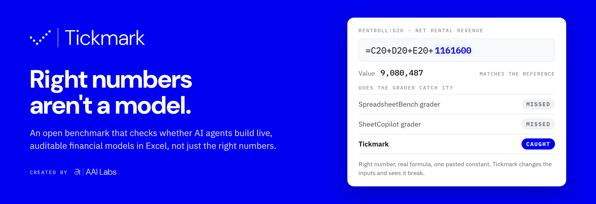

<p align="center">
  
</p>

<p align="center">
  <a href="https://github.com/kostas-antiup/tickmark/actions/workflows/ci.yml"></a>
  
  
  
  
  
  <a href="LICENSE"></a>
</p>

**Tickmark checks whether an AI agent built the financial model, not just whether it typed the right numbers.**

Spreadsheet benchmarks grade the values in the cells. An agent that pastes the expected
number passes the same check as one that builds a live formula chain, and the client who
changes an assumption next quarter finds out the hard way. Tickmark recalculates every
submitted workbook, changes its inputs, and audits how each number is built against a
hidden reference model. Grading is deterministic and free to run: the same workbook always
gets the same verdict.

<p align="center">
  
  <br><sub>24-second demo on case 14_07 · <a href="assets/demo.mp4">MP4 version</a></sub>
</p>

## Headline result

We broke each of the 35 reference models in seven ways, from a pasted final answer to a
formula that is 1% off, and graded all 245 workbooks with each benchmark's rule:

| Grader | Broken workbooks caught | Correct models accepted |
|---|---:|---:|
| SpreadsheetBench rule | 70 / 245 (29%) | 35 / 35 |
| SheetCopilot rule | 70 / 245 (29%) | 35 / 35 |
| **Tickmark** | **245 / 245 (100%)** | **35 / 35** |

The existing rules catch only the 70 workbooks with wrong numbers. They miss all 175 whose
numbers stay right: pasted answers (final, half or all targets, or one intermediate) and
formula-shaped constants such as `=9080487`. Both rules are reproduced from their upstream
code in [`baselines.py`](src/tickmark/baselines.py). Recalculated in Microsoft Excel;
[reproduce it](docs/results.md#reproduce).

### One formula, three verdicts

Case `14_07` is a rent roll. This submission gets all 20 target values right, every target
is a formula, and every formula traces back to the inputs:

```text
RentRoll!G20  =C20+D20+E20+1161600        9,080,487   matches the reference
```

`1161600` is the 3-Bed total, pasted where `F20` belongs. Value-only graders miss it.
Tickmark catches it: it changes the inputs, sees `G20` stop matching the reference model, and
with `--sensitivity` names the five 3-Bed inputs the cell ignores. Try it:

```bash
uv run python scripts/run_benchmark.py --case data/cases/14_07 --workbook examples/14_07-hidden-constant.xlsx --sensitivity
```

## Leaderboard

AI agents on the three pilot cases. **Real models** is Tickmark's verdict; **right numbers**
is all a value-only benchmark would check. Details, and how to add your agent:
[docs/leaderboard.md](docs/leaderboard.md).

<!-- leaderboard:start -->
| # | Agent | Interface | Real models | Right numbers | Formulas | Traceable |
|---:|---|---|---:|---:|---:|---:|
| 1 | OpenCode · GLM-5.2 | Coding agent (CLI) | **3 / 3** | 3 / 3 | 100% | 100% |
| 2 | Qwen 2.5 7B | Chat API (Ollama, local) | **0 / 3** | 0 / 3 | 62% | 44% |
<!-- leaderboard:end -->

## How it works

<p align="center">
  
</p>

| Check | Fails when |
|---|---|
| Correct values | a target value differs from the reference |
| Formula coverage | a target cell holds a constant or is empty |
| Traceability | a target's formula chain does not end at declared input cells |
| No hardcoded values | a number is pasted inside a target's formula chain |
| No fake formulas | a formula references no cells, such as `=9080487` |
| Input change | after an input changes, the output does not move to the reference's new value |
| Perturbation | under changed inputs, any target stops matching the reference recalculated with the same inputs |

A workbook is **correct** when every value matches, **auditable** when every construction
check passes, and **passes** when it is both. Formulas are never compared as text:
`SUM(C20:F20)` and `C20+D20+E20+F20` are equally right if they behave the same.

The perturbation check runs up to five fixed scenarios (inputs up, down, mixed, switches
flipped, years moved) and up to ten branch-seeking scenarios that try to flip each `IF`,
`MIN`, `MAX`, `IFERROR` and `ABS` decision in the reference. Details in
[docs/methodology.md](docs/methodology.md).

## Quickstart

You need Python 3.14, [uv](https://docs.astral.sh/uv/), and a spreadsheet engine: Microsoft
Excel on Windows, or LibreOffice on any OS.

```bash
git clone https://github.com/kostas-antiup/tickmark.git
cd tickmark
uv sync --dev --extra audit
```

Check the setup: every reference workbook must pass its own case.

```bash
uv run python scripts/run_benchmark.py --case data/cases --golden
```

Grade a completed workbook:

```bash
uv run python scripts/run_benchmark.py --case data/cases/14_07 --workbook path/to/output.xlsx
```

Reports are written to `results/` as JSON. Choose the engine with
`--engine excel|libreoffice|cached`; the default picks the first one available.

## Run an agent

Three steps. [docs/agents.md](docs/agents.md) has install and sign-in steps for every agent.

```bash
# 1. See which agents are ready on this machine, and what each one still needs
uv run python scripts/run_agents.py --list

# 2. Set one up. Free options: a local model (no account), or a free OpenRouter key in .env
ollama pull qwen2.5:7b
cp .env.example .env    # then add OPENROUTER_API_KEY=...

# 3. Run the three-case pilot, then open results/runs/first-run/report.html
uv run python scripts/run_real_agent_suite.py --agents ollama-qwen --run-id first-run
uv run python scripts/run_real_agent_suite.py --agents openrouter:z-ai/glm-5.2:free --run-id glm
```

| Type | How the agent works | Configured |
|---|---|---|
| `cli` | Runs in an empty folder holding only `input.xlsx` and `TASK.md`, uses its own tools, saves `output.xlsx` | Claude Code, Codex, OpenCode, Gemini CLI |
| `chat` | Any OpenAI-compatible API; reads the workbook as text and replies with JSON cell edits | Gemini 2.5 Flash and Pro, GLM 5.2 (OpenRouter), Llama 3.3 70B (Groq), Qwen 2.5 7B (Ollama) |
| `manual` | You solve `TASK.md` in a chat UI and save `output.xlsx` back into the run folder | ChatGPT, Excel Copilot |
| `<provider>:<model>` | Any model a provider serves, no config edit: `openrouter:z-ai/glm-5.2:free`, `ollama:llama3.1:8b`, `litellm:<model>` | 460+ on OpenRouter, 3,400+ via LiteLLM, any Ollama model, OpenAI, Gemini, Groq |

Agents live in [`configs/agents.toml`](configs/agents.toml); API keys come from environment
variables named there or a git-ignored `.env`, and a run checks that every agent can start
before it begins. Every
run writes a report per case, `summary.md`, and a self-contained `report.html` that puts
value-only grading next to Tickmark's verdict. Add any CLI agent or OpenAI-compatible model
with one table ([how](docs/agents.md#add-your-own-agent)).

## The cases

35 financial models from the Template category of
[SpreadsheetBench 2](https://github.com/RUCKBReasoning/SpreadsheetBench-2): 1,874 target
cells to fill from 1,061 input cells.

| Model family | Cases | Target cells |
|---|---:|---:|
| Equity research forecast | 11 | 557 |
| Real estate DCF | 8 | 546 |
| Cash sweep and debt waterfall | 4 | 212 |
| LBO debt schedule | 2 | 170 |
| M&A model | 3 | 125 |
| Earnings normalisation | 1 | 73 |
| Real estate direct capitalisation | 2 | 63 |
| M&A accretion / dilution | 2 | 52 |
| Financial model basics | 1 | 40 |
| DCF valuation | 1 | 36 |
| **Total** | **35** | **1,874** |

All 97 Template tasks were screened. A case is kept only if its reference is itself a clean
model: every target is a live formula that traces to input constants, with no volatile or
iterative functions in the chain, every assumption is an input or stated on the sheet, and
the final output responds to an input change. Every reference was recalculated in Excel
before inclusion. The agent sees only `input.xlsx` and the instruction; `golden.xlsx` and
`case.json` stay hidden. Format, selection and per-case notes:
[data/cases/README.md](data/cases/README.md).

## Compared with other spreadsheet benchmarks

| | SpreadsheetBench | SheetCopilot | BlueFin | **Tickmark** |
|---|---|---|---|---|
| What is graded | Cell values in the answer range | Checklist of values and formatting | 3,225 rubric items | Values, formulas and their lineage |
| Grader | Deterministic | Deterministic | LLM agent judge | Deterministic, zero API cost |
| Catches pasted correct answers | No | No | Where a rubric item covers it | **Yes, always** |
| Re-tests with new inputs | No¹ | No | Hand-written checks on chosen cells | **Every input and every target, against the reference** |

¹ SpreadsheetBench re-runs code solutions on extra test spreadsheets. For agents that edit
the workbook directly, its rule compares the values in the delivered file.

The same agents also run on BlueFin synthesis tasks, graded by BlueFin's own judge, and
on SheetCopilot examples, graded against their checklists
([docs/integrations.md](docs/integrations.md)).

## Results so far

| Run | Result |
|---|---|
| Reference self-test, 35 cases | 35 / 35 pass, Excel and LibreOffice |
| Broken workbooks, 245 | 245 / 245 caught, each with the scores its manifest predicts |
| AI agents | see the [leaderboard](#leaderboard) |

Commands, timings and details: [docs/results.md](docs/results.md).

## Repository layout

```text
src/tickmark/        evaluator, recalculation engines, scenarios, agents, reports
scripts/             command-line entry points
data/cases/          35 cases: input.xlsx, golden.xlsx, case.json
examples/            a graded example submission
configs/agents.toml  agent definitions
docs/                methodology, results, agents, integrations
tests/               unit and integration tests
```

## Development

```bash
uv run pytest tests
uv run ruff check .
uv run ruff format --check .
uv run ty check .
```

Tests that need Excel or LibreOffice are skipped when the engine is missing. CI runs the
full suite and the LibreOffice golden and broken-workbook checks on every push. See
[CONTRIBUTING.md](CONTRIBUTING.md).

## Citation

```bibtex
@software{tickmark2026,
  title        = {Tickmark: Auditing Whether Spreadsheet Agents Build Real Financial Models},
  author       = {Ragauskas, Kostas and Kaburu, Jadrine and Abunga, Jeremiah and
                  Paulavi{\v{c}}ius, Jonas and Antanaityt{\.e}, Ugn{\.e}},
  organization = {AAI Labs},
  year         = {2026},
  url          = {https://github.com/kostas-antiup/tickmark}
}
```

The cases are derived from SpreadsheetBench 2; please cite it as well.

## About

<a href="https://www.aai-labs.com">
  <picture>
    <source media="(prefers-color-scheme: dark)" srcset="assets/logo/aai-labs-logo-white.svg">
    
  </picture>
</a>

Tickmark was created by AAI Labs: Kostas Ragauskas, Jadrine Kaburu, Jeremiah Abunga,
Jonas Paulavičius and Ugnė Antanaitytė.

Code is released under the [MIT License](LICENSE). The case workbooks come from
SpreadsheetBench 2, released under the MIT License; see
[data/cases/README.md](data/cases/README.md#source-and-license).
