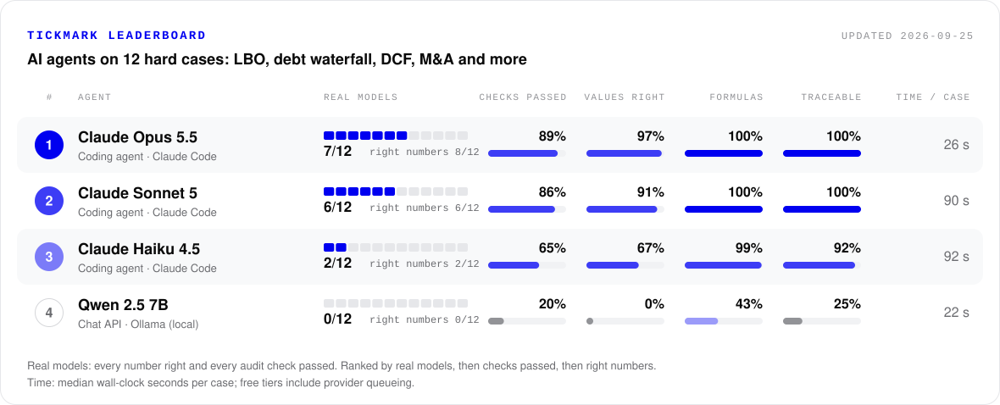

# Agent leaderboard

There are two boards. Both are generated by `scripts/leaderboard.py` from the files in
[`leaderboard/`](../leaderboard/); do not edit the tables by hand.

- **Hard cases**, the main board shown in the README: 12 cases chosen for
  difficulty (`02_03`, `02_06`, `06_03`, `06_13`, `09_03`, `09_04`, `10_02`, `11_01`, `13_06`, `14_06`, `14_08`, `16_01`). They are the five cases whose reference formulas branch the
  most (LBO debt schedules, cash sweeps and debt waterfalls) plus the largest and
  multi-sheet models, and they cover 8 of the 10 model families.
- **Pilot cases**: three small cases (`02_01`, `06_18`, `14_07`) for a quick end-to-end run. Five agents
  pass all three, so this board no longer separates the strongest ones.

<p align="center"></p>

- **Real models**: cases passed, meaning every number right and every audit check passed.
- **Right numbers**: cases with every number right, which is all a value-only benchmark
  checks.
- **Checks passed**: share of all audit checks passed across the cases (7 per case, equal
  weight).
- **Values right**, **Formulas**, **Traceable**: mean share of target cells with the right
  value, holding a formula, and tracing back to the declared inputs.
- **Time per case**: median wall-clock seconds per case. On free tiers this includes
  provider queueing and rate-limit waits, so compare speed with care.

Ranked by real models, then checks passed, then right numbers; agents equal on all three
share a rank. An agent joins a board once it has a graded result on every case of that
board.

## Hard cases

| # | Agent | Interface | Real models | Right numbers | Checks passed | Values right | Formulas | Traceable | Time per case |
|---:|---|---|---:|---:|---:|---:|---:|---:|---:|
| 1 | Claude Opus 5.5 | Coding agent · Claude Code | **7 / 12** | 8 / 12 | 89% | 97% | 100% | 100% | 26 s |
| 2 | Claude Sonnet 5 | Coding agent · Claude Code | **6 / 12** | 6 / 12 | 86% | 91% | 100% | 100% | 90 s |
| 3 | Claude Haiku 4.5 | Coding agent · Claude Code | **2 / 12** | 2 / 12 | 65% | 67% | 99% | 92% | 92 s |
| 4 | Qwen 2.5 7B | Chat API · Ollama (local) | **0 / 12** | 0 / 12 | 20% | 0% | 43% | 25% | 22 s |

| Agent | Engine | Date | Run |
|---|---|---|---|
| Claude Opus 5.5 | excel | 2026-09-25 | `claude-hard` |
| Claude Sonnet 5 | excel | 2026-09-25 | `claude-hard` |
| Claude Haiku 4.5 | excel | 2026-09-25 | `claude-hard` |
| Qwen 2.5 7B | excel | 2026-09-25 | `qwen2.5-7b` |

- **Claude Opus 5.5**: Anthropic frontier model. Run as a Claude Code subagent with a fresh context in an isolated folder, with no access to the repository.
- **Claude Sonnet 5**: Anthropic frontier model. Run as a Claude Code subagent with a fresh context in an isolated folder, with no access to the repository.
- **Claude Haiku 4.5**: Anthropic's small model. Run as a Claude Code subagent with a fresh context in an isolated folder, with no access to the repository.
- **Qwen 2.5 7B**: Runs on a laptop GPU at no cost. On all 35 cases: 0 real models, 50% of target cells held formulas, 2% of values were right.

## Pilot cases

| # | Agent | Interface | Real models | Right numbers | Checks passed | Values right | Formulas | Traceable | Time per case |
|---:|---|---|---:|---:|---:|---:|---:|---:|---:|
| 1 | Claude Opus 5.5 | Coding agent · Claude Code | **3 / 3** | 3 / 3 | 100% | 100% | 100% | 100% | 80 s |
| 1 | Claude Sonnet 5 | Coding agent · Claude Code | **3 / 3** | 3 / 3 | 100% | 100% | 100% | 100% | 146 s |
| 1 | Nemotron 3 Ultra | Chat API · OpenRouter (free) | **3 / 3** | 3 / 3 | 100% | 100% | 100% | 100% | 24 s |
| 1 | OpenCode · GLM-5.2 | Coding agent · OpenCode CLI | **3 / 3** | 3 / 3 | 100% | 100% | 100% | 100% | 90 s |
| 1 | Qwen3.8 27B | Chat API · OpenRouter (free) | **3 / 3** | 3 / 3 | 100% | 100% | 100% | 100% | 343 s |
| 6 | Nemotron 3 Super | Chat API · OpenRouter (free) | **2 / 3** | 2 / 3 | 90% | 98% | 100% | 100% | 36 s |
| 7 | Ling 3.0 Flash Fin | Chat API · OpenRouter (free) | **2 / 3** | 2 / 3 | 86% | 90% | 100% | 100% | 9 s |
| 7 | Nex N2.5 Pro | Chat API · OpenRouter (free) | **2 / 3** | 2 / 3 | 86% | 83% | 100% | 100% | 137 s |
| 9 | Claude Haiku 4.5 | Coding agent · Claude Code | **1 / 3** | 1 / 3 | 71% | 71% | 100% | 100% | 34 s |
| 10 | Qwen 2.5 7B | Chat API · Ollama (local) | **0 / 3** | 0 / 3 | 29% | 3% | 62% | 44% | 11 s |

| Agent | Engine | Date | Run |
|---|---|---|---|
| Claude Opus 5.5 | excel | 2026-09-25 | `claude-subagents` |
| Claude Sonnet 5 | excel | 2026-09-25 | `claude-subagents` |
| Nemotron 3 Ultra | excel | 2026-09-25 | `openrouter-pilot` |
| OpenCode · GLM-5.2 | libreoffice | 2026-09-20 | `opencode-real-agent-suite-clarified` |
| Qwen3.8 27B | excel | 2026-09-25 | `openrouter-pilot` |
| Nemotron 3 Super | excel | 2026-09-25 | `openrouter-pilot` |
| Ling 3.0 Flash Fin | excel | 2026-09-25 | `openrouter-pilot-b` |
| Nex N2.5 Pro | excel | 2026-09-25 | `openrouter-pilot-b` |
| Claude Haiku 4.5 | excel | 2026-09-25 | `claude-subagents` |
| Qwen 2.5 7B | excel | 2026-09-25 | `qwen2.5-7b` |

- **Claude Opus 5.5**: Anthropic frontier model, run as a Claude Code subagent with a fresh context in an isolated folder (no repo access); its workbook was graded like any other.
- **Claude Sonnet 5**: Anthropic frontier model, run as a Claude Code subagent with a fresh context in an isolated folder (no repo access).
- **Nemotron 3 Ultra**: NVIDIA Nemotron 3 Ultra 550B (A55B), openrouter:nvidia/nemotron-3-ultra-550b-a55b:free.
- **OpenCode · GLM-5.2**: Run by the AAI Labs team through a paid OpenCode Zen account.
- **Qwen3.8 27B**: Alibaba Qwen, openrouter:qwen/qwen3.8-27b:free. Its time per case is mostly its own output: about 10,000 tokens on 02_01 and 14_07.
- **Nemotron 3 Super**: NVIDIA Nemotron 3 Super 120B (A12B), openrouter:nvidia/nemotron-3-super-120b-a12b:free.
- **Ling 3.0 Flash Fin**: inclusionAI's finance-tuned model, openrouter:inclusionai/ling-3.0-flash-fin:free.
- **Nex N2.5 Pro**: Nex AGI, openrouter:nex-agi/nex-n2.5-pro:free.
- **Claude Haiku 4.5**: Anthropic's small model, run the same way as Opus and Sonnet. Its formulas were live but wrong in two places: on 02_01 it added growth rates that the workbook's note says compound, and on 14_07 its loss-to-lease charged market rent on vacant units too, so the rent total stopped responding to the unit count.
- **Qwen 2.5 7B**: Runs on a laptop GPU at no cost. On all 35 cases: 0 real models, 50% of target cells held formulas, 2% of values were right.

## Add an agent

1. Run the hard set, for any configured agent or any `<provider>:<model>`
   ([docs/agents.md](agents.md)):

   ```bash
   uv run python scripts/run_real_agent_suite.py --set hard \
       --agents openrouter:<model-id> --run-id my-agent
   ```

2. Add it and re-render the card and tables:

   ```bash
   uv run python scripts/leaderboard.py add results/runs/my-agent --agent <folder> \
       --name "<Agent>" --model "<Model>" --interface "Chat API · OpenRouter"
   ```

   `<folder>` is the agent's folder inside the run, for example
   `openrouter-z-ai-glm-5.2-free`. For the pilot board, run with `--set pilot` and add
   with `--board pilot`.

3. Open a pull request with `leaderboard/`, `assets/leaderboard.svg`, `README.md` and
   `docs/leaderboard.md`.
